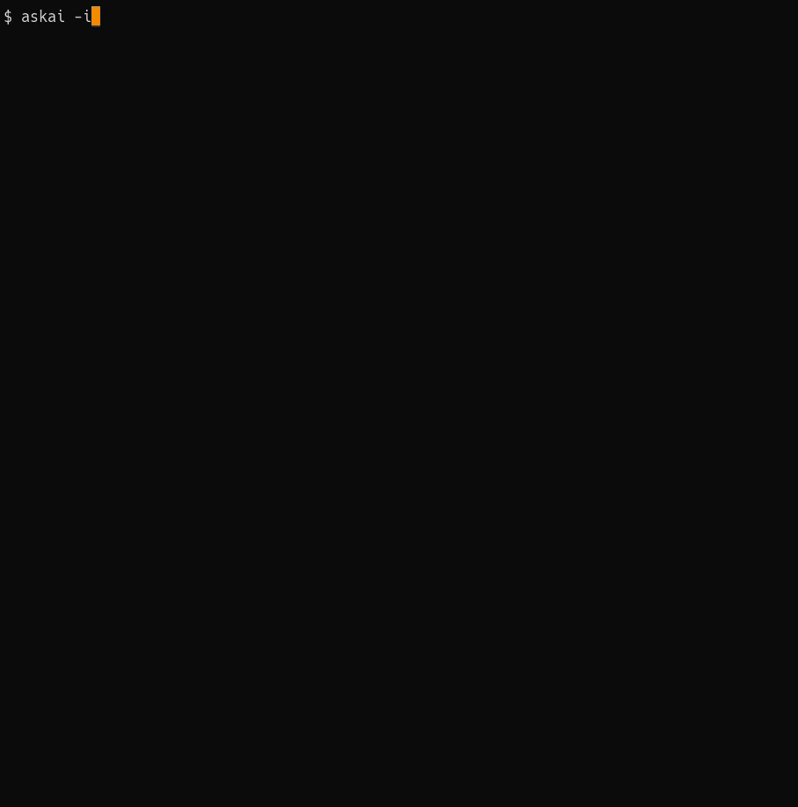

<h1 align="center">askai</h1>

<p align="center">
AI is with you.<br>
Powered by <a href="https://openai.com/blog/openai-api">OpenAI API</a>
</p>

<p align="center">
<a href="https://github.com/koki-develop/askai/releases/latest"></a>
<a href="https://github.com/koki-develop/askai/actions/workflows/ci.yml"></a>
<a href="https://codeclimate.com/github/koki-develop/askai/maintainability"></a>
<a href="https://goreportcard.com/report/github.com/koki-develop/askai"></a>
<a href="./LICENSE"></a>
</p>

<p align="center">

</p>

## Contents

- [Installation](#installation)
- [Usage](#usage)
- [Getting Started](#getting-started)
- [LICENSE](#license)

## Installation

### Homebrew Tap

```console
$ brew install koki-develop/tap/askai
```

### `go install`

```console
$ go install github.com/koki-develop/askai@latest
```

### Releases

Download the binary from the [releases page](https://github.com/koki-develop/askai/releases/latest).

## Usage

```console
$ askai --help
AI is with you.

Usage:
  askai [flags] [question]

Flags:
  -k, --api-key string   the OpenAI API key
      --configure        configure askai
  -g, --global           configure askai globally (only for --configure)
  -h, --help             help for askai
  -i, --interactive      interactive mode
  -m, --model string     the chat completion model to use (default "gpt-3.5-turbo")
  -v, --version          version for askai
```

## Getting Started

### Setup

First, run the `askai` with the `--configure` flag set.

```console
$ askai --configure
```

Upon doing so, you will initiate an interactive setup session.  
Input the following items:

- OpenAI API Key: API key created on [the OpenAI platform](https://platform.openai.com).
- Model: The chat completion model to use. (Available: `gpt-4`, `gpt-4-0613`, `gpt-4-32k`, `gpt-4-32k-0613`, `gpt-3.5-turbo`, `gpt-3.5-turbo-0613`, `gpt-3.5-turbo-16k`, `gpt-3.5-turbo-16k-0613`)

Once the setup is completed, a configuration file named `.askai` will be saved.  
Now, you are all set.

> **Note**
> If you run the `askai --configure` with the `--global` flag set, the configuration file will be saved as `$HOME/.askai`.  
> This file is referred to when executing `askai`, if there is no `.askai` in the current directory.

### Ask a question to AI

By passing a question an argument to `askai`, you can obtain an answer from AI.

```console
$ askai 'Please write a program in Go that outputs "Hello world”.'
```


### Ask a question to AI interactively

By running `askai` with the `-i` or `--interactive` flag set, you can ask questions to AI in an interactive manner.

```console
$ askai -i
```


## LICENSE

[MIT](./LICENSE)
